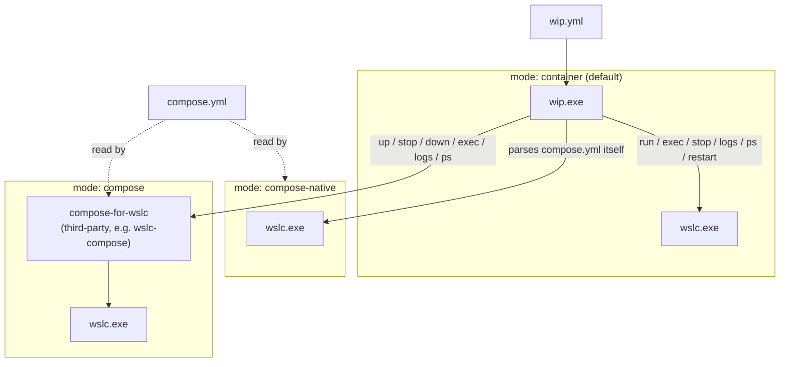
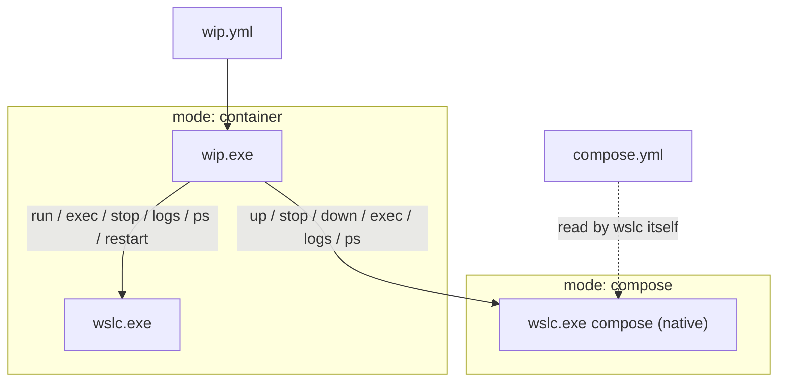

# wip

[](https://github.com/slidict/wip/actions/workflows/test.yml)
[](LICENSE)
[](#requirements--installation)

Homepage: https://wslc-wip.slidict.com/ · **[Full documentation: wip Wiki](https://github.com/slidict/wip/wiki)**

`wip` is an OSS CLI wrapper that brings a [`dip`](https://github.com/bibendi/dip)-like
workflow to Microsoft WSLC. It collects a project's container, image, environment variables, and
commands into a single `wip.yml`, and forwards them to `wslc.exe` / `wslc` as safe argument arrays
(no shell interpolation).


> **Status:** early release. Expect to track WSLC's own interface as it evolves.

> **v2 switched from Ruby to a C# Native AOT binary.** Through v1, wip was a Ruby gem, which
> meant a Ruby installation and a gem to keep in step with it. From v2 there is neither: `wip.exe`
> is a single self-contained executable with no runtime to install, and no interpreter to start
> before a command runs, so it should be noticeably quicker off the mark.
>
> The Ruby implementation has no further updates planned, but it is not gone — it stays available
> at [v1.1.4](https://github.com/slidict/wip/releases/tag/v1.1.4) and as the
> [`wslc-wip` gem](https://rubygems.org/gems/wslc-wip) on RubyGems.

This README covers the fastest path to a running `wip.yml`. For everything else — every config
key, every command's flags, guides, and troubleshooting — see the **[wip Wiki](https://github.com/slidict/wip/wiki)**.

## Contents

- [Which mode should you use?](#which-mode-should-you-use)
- [Architecture](#architecture)
- [AI-assisted initialization](#ai-assisted-initialization)
- [Requirements & installation](#requirements--installation)
- [Quick start](#quick-start)
- [Configuration](#configuration)
- [Commands](#commands)
- [Common errors](#common-errors)
- [Known gaps & TODO](#known-gaps--todo)
- [Development](#development)
- [Contributing](#contributing)
- [License](#license)

## Which mode should you use?

`wip.yml` runs in one of three modes, set with `mode:`. Pick the one that matches your project:

| Situation | Use |
|---|---|
| No `compose.yml` — wip manages containers directly | `mode: container` (default) |
| Have `compose.yml`, don't want to install a third-party tool | `mode: compose-native` |
| Have `compose.yml` and already use/prefer a third-party compose-for-`wslc` tool | `mode: compose` |

`wip init` picks `compose-native` automatically when it finds a `compose.yml`, `compose.yaml`,
`docker-compose.yml`, or `docker-compose.yaml` next to it, and `container` otherwise — see
[Commands](#commands). For the full breakdown and trade-offs, see
[Choosing a Mode](https://github.com/slidict/wip/wiki/Choosing-a-Mode) on the wiki.

## Architecture

wip never talks to Docker: every mode ultimately shells out to `wslc.exe` / `wslc`, Microsoft's
own container CLI, as a safe argv array. What differs between modes is *what sits between*
`wip.yml` and `wslc` — today WSLC has no native Compose support, so `mode: compose` and
`mode: compose-native` exist to cover that gap in two different ways:



- **`mode: container`** — no `compose.yml` involved; wip drives `wslc` directly for one
  container plus its `dependencies:`.
- **`mode: compose-native`** — wip parses `compose.yml` itself and drives `wslc` the same way
  `mode: container` does, one service at a time. See
  [Compose Native Mode](https://github.com/slidict/wip/wiki/Compose-Native-Mode).

  `services.<name>` keys:

  | Key | Status |
  |---|---|
  | `image`, `build`, `command`, `environment`, `volumes`, `working_dir`, `user`, `restart`, `profiles`, `healthcheck` | Supported |
  | `ports` | Supported — short syntax only (e.g. `"3000:3000"`), not long-syntax mappings |
  | `depends_on` | Supported — `condition: service_started` or `service_healthy` |
  | `tty`, `stdin_open` | Ignored — TTY/stdin allocation is decided per invocation, not per service |
  | `networks` | Ignored — every service already shares one project network |
  | `cap_add` | Ignored — `wslc run`/`exec` has no capability flag to forward it to |
  | `dns` | Ignored — `wslc run`/`exec` has no flag to set per-container DNS servers |
  | anything else | `ConfigError` naming the key |

  "Ignored" means accepted without error but with no effect — not a silent no-op passed off as
  working, but a deliberate choice documented in [`ComposeFile.cs`](src/Wip.Core/Compose/ComposeFile.cs).
- **`mode: compose`** — wip bridges to a separately-installed compose-for-wslc tool
  (`compose.command` in `wip.yml`), which does the orchestration and itself drives `wslc`. wip
  contributes no orchestration logic here, only argument forwarding.

### If/when WSLC ships native Compose support

`mode: compose-native` is a deliberate stopgap (see the `Modes` doc comment in
[`Config.cs`](src/Wip.Core/Configuration/Config.cs)), not a permanent feature — it exists only
because WSLC itself has no Compose command yet. Until that changes, wip keeps all three modes
exactly as they are today. Once WSLC ships a complete native Compose command of its own (e.g.
`wslc compose up`), `mode: compose-native` retires and `mode: compose` simply points at that
native command instead of a third-party bridge:



Either way, wip stays a thin, safe-argv wrapper around `wip.yml` — it never grows an
orchestration engine of its own; that job belongs to `wslc`.

## AI-assisted initialization

`wip init --ai` analyzes a bounded selection of project metadata (for example `README.md`,
`Gemfile`, `package.json`, `Procfile`, and Compose files), asks for a natural-language description,
and displays a generated `wip.yml`. If a `wip.yml` already exists it is supplied as the basis for
an update. The candidate is parsed and validated by wip before the confirmation prompt; AI output
never writes files directly.

```powershell
wip init --ai
```

`wip init --ai` talks to a local AI server through the OpenAI-compatible `/chat/completions`
endpoint that both [Ollama](https://ollama.com) (`ollama serve`) and
[LM Studio](https://lmstudio.ai)'s local server already expose, so wip takes no dependency on a
specific vendor's native protocol or on Windows-only AI APIs — this works the same way on any
machine, Copilot+ PC or not, once a model is pulled or loaded locally.

Configure it with two environment variables:

- `WIP_AI_BASE_URL` — the server's OpenAI-compatible base URL. Defaults to
  `http://localhost:11434/v1` (Ollama's default). Point it at LM Studio
  (typically `http://localhost:1234/v1`) or any other OpenAI-compatible local server instead.
- `WIP_AI_MODEL` — the model name already pulled or loaded in that server, e.g. `llama3.1`. If
  unset, wip asks the server's `/models` endpoint instead: with exactly one chat-capable model
  loaded (embedding models are ignored) it uses that one automatically; with none or more than one
  it fails up front and, if there's more than one, lists them so you can set `WIP_AI_MODEL`.

Both `wip doctor --url <url>` and `wip init --ai --url <url>` accept a `--url` flag that overrides
`WIP_AI_BASE_URL` for that one invocation, so you can point at a different server (e.g. LM Studio)
without changing your environment:

```powershell
wip doctor --url http://localhost:1234/v1
wip init --ai --url http://localhost:1234/v1
```

`wip doctor` reports whether the server is reachable and a model is configured, and
`wip init --ai` checks the same things up front — before it asks for a description — so a missing
server or model fails immediately with a fix, not after a prompt that was never going anywhere.

For a full walkthrough with real output, troubleshooting (context-length errors, ambiguous models,
a missing `/v1` in the URL), and what wip does when the model's YAML doesn't validate, see
[AI-Assisted Initialization](https://github.com/slidict/wip/wiki/AI-Assisted-Initialization) on the
wiki.

Collection is allow-listed and capped at 24 files, 64 KiB per file, and 256 KiB total. Files such as
`.env` and arbitrary source files are not collected. Review the displayed YAML before answering
`y`; any other answer leaves the existing file untouched.

## Requirements & installation

Windows with WSL2 and Microsoft WSLC. There is no runtime to install: `wip.exe` is a
self-contained Native AOT binary.

Install directly from this repository with [Scoop](https://scoop.sh/):

```powershell
scoop install https://raw.githubusercontent.com/slidict/wip/main/wip.json
```

Scoop puts `wip.exe` on your PATH and can update it later with `scoop update wip`.

Alternatively, install it manually: download and extract `wip-<version>-win-x64.zip` from
[Releases](https://github.com/slidict/wip/releases), then add the directory holding `wip.exe`
to your PATH.

**WinGet is on the way.** The manifest has been submitted as
[microsoft/winget-pkgs#418285](https://github.com/microsoft/winget-pkgs/pull/418285) and is
waiting on review — new packages are reviewed by hand, so it takes a few days. Once it merges,
this is all it takes:

```powershell
winget install Slidict.Wip
```

From source: `dotnet publish src/Wip.Cli/Wip.Cli.csproj -c Release -r win-x64`. This links
with **MSVC** (Native AOT), so the .NET SDK alone stops with `Platform linker not found` —
install it first:

```powershell
winget install Microsoft.VisualStudio.2022.BuildTools --override "--quiet --wait --add Microsoft.VisualStudio.Workload.VCTools --includeRecommended"
```

If you already have Visual Studio 2022, add the **Desktop development with C++** workload
through the Visual Studio Installer instead. Either way an ordinary shell works afterwards —
the build locates MSVC itself, so no developer command prompt is needed.

If the workload is already installed and `Platform linker not found` still shows up — often
with a `'vswhere.exe' is not recognized as an internal or external command` line right above
it — the linker setup script located the Visual C++ tools fine but then handed off to a step
that shells out to a bare `vswhere.exe`, which only resolves inside a Developer Command Prompt
that has already put it on `PATH`. Add its folder once and any ordinary shell works from then
on:

```powershell
[Environment]::SetEnvironmentVariable('Path', $env:Path + ';C:\Program Files (x86)\Microsoft Visual Studio\Installer', 'User')
```

Open a new shell afterwards — the change does not apply to the one that ran the command. See
[Development](#development) for more on building from source.

### Running it from a WSL2 shell

wip.exe runs on the Windows side and drives `wslc.exe` directly, but it is meant to be typed
from wherever you work — including a WSL2 shell, which reaches it over Windows interop:

```bash
$ cd ~/myproject && wip.exe up -d
```

**The `.exe` is required in bash**, which does not consult `PATHEXT` the way PowerShell and
cmd do — so `wip` alone works in PowerShell but finds nothing in bash. To drop it there, put a
shim on your PATH inside the distribution:

```bash
sudo tee /usr/local/bin/wip >/dev/null <<EOF
#!/bin/sh
exec "$(command -v wip.exe)" "\$@"
EOF
sudo chmod +x /usr/local/bin/wip
```

The heredoc is deliberately unquoted, so `command -v wip.exe` runs now and the absolute path is
written into the file. That matters more than it looks: `sudo` replaces PATH with `secure_path`,
which keeps `/usr/local/bin` but drops the Windows entries WSL appends — so a shim that looked
`wip.exe` up at run time would find nothing under `sudo`, and non-login shells can differ the
same way. Resolving once at setup sidesteps all of it.

`alias wip=wip.exe` in your shell profile is the smaller alternative, but it only applies to an
interactive shell — not to a Makefile, a script, `sudo`, or `ssh host wip …`.

Both need `wip.exe` to resolve at least once, which it does through the Windows PATH that WSL
appends — that is where WinGet's `wip.exe` alias lives. If you have turned that off with
`appendWindowsPath = false` in `/etc/wsl.conf`, `command -v` finds nothing and writes an empty
path, so put the full path in by hand. Re-run the snippet if `wip.exe` ever moves; upgrading
through WinGet does not move it, because the alias it puts on PATH stays at a fixed location.

> **Keep the project on the Windows filesystem.** A project under `~/proj` inside a
> distribution reaches wip as a UNC path (`\\wsl.localhost\Ubuntu\home\u\proj`). wslc
> resolves a `-v` source as a Windows path, and when the result does not exist it mounts an
> *empty directory* rather than failing — so wip's earlier translation of that UNC path to
> `/home/u/proj` booted a container with none of your files in it and no error to explain
> why. wip therefore refuses `sync.source` on the WSL filesystem by name, and `wip up` and
> `wip run` warn about `volumes:`, which wslc resolves itself. Put the project on `C:\`
> (`C:\src\myproject`) and run wip from there.
>
> **Whether wslc can mount the UNC path directly is a separate question, and unmeasured** —
> refusing is the safe default until someone runs it, not a measured verdict. This all comes
> from reading wslc's source, so both other readings stay one environment variable away:
> `WIP_WSL_PATH=unc` hands wslc the UNC path unchanged and `WIP_WSL_PATH=linux` restores the
> old `/home/...` translation. Either way it changes only what `sync.source` resolves to — it
> rewrites no `volumes:` entry, so the `wip up` / `wip run` warning stands under every value.
> If you measure what wslc really does, please
> [say so in an issue](https://github.com/slidict/wip/issues) — see
> [the migration plan](docs/csharp-migration-plan.md) §3.

## Quick start

This walks through `mode: container` (the default). Already have a `compose.yml`? See
[Which mode should you use?](#which-mode-should-you-use) first, or read the wiki's
[Getting Started](https://github.com/slidict/wip/wiki/Getting-Started) guide. Install `wip.exe`
first — see [Requirements & installation](#requirements--installation).

```powershell
cd my-project
wip init   # writes a starter wip.yml; edit the TODOs, then:
wip doctor
wip build
wip up -d
wip rails console
```

## Configuration

Put a `wip.yml` in your project root. Running from a subdirectory walks up to find it, or pass
`--config PATH` to point at one explicitly.

```yaml
version: 1
mode: container # default
wslc:
  command: auto # tries wslc.exe, wslc, then System32; an absolute path also works
container: app # required once dependencies: has entries; which one `up`/`exec`/`run`/`build`/`interaction:`
               # target. No default — a project must say which entry is the primary one explicitly.
network: app-tier # optional; shared by every dependencies: entry so containers can resolve each other by name
dependencies:
  app: # container: points here — the one container wip execs into and runs commands in
    image: slidict/slidict:development
    workdir: /app
    interactive: false
    remove: true
    command: server # extra args appended when `wip up` creates the container
                     # (omit to use the image's default CMD)
    env:
      RAILS_ENV: development
      PORT: "3000"
    ports:
      - "3000:3000"
    volumes:
      - ".:/app"
  redis:
    image: redis:latest
  development.mysql:
    image: mysql:8.0
    command: --default-authentication-plugin=mysql_native_password
    env:
      MYSQL_ROOT_PASSWORD: password
      MYSQL_DATABASE: development
    healthcheck: # optional; `wip up` waits for this before starting whatever needs it
      test: ["CMD", "mysqladmin", "ping", "-h", "localhost"]
      interval: 2 # seconds between checks (default 1)
      timeout: 5 # seconds a single check may take before it counts as a failure (default 1)
      retries: 10 # consecutive failures after start_period before giving up (default 3)
      start_period: 10 # seconds of grace before failures start counting (default 0)
interaction:
  rails:
    type: exec
    command: bin/rails
    container: app
    interactive: true
    workdir: /app
    env:
      RAILS_ENV: development
  bundle:
    command: bundle
  rspec:
    command: bundle exec rspec
  shell:
    command: bash
    interactive: true
  migrate:
    type: run
    command: bundle exec rails db:migrate
    image: slidict/slidict:development
    remove: true
  build:
    type: build
    context: .
    tag: slidict/slidict:development
sync: # optional; mirror the source into a named volume instead of bind-mounting it live
  exclude:
    - .git
    - tmp/
    - node_modules/
```

`env` values are stringified. `wip config` masks any key matching token, password, secret,
credential, or auth. Keep real secrets out of the config file and in your runtime environment
instead — see [Secret Masking](https://github.com/slidict/wip/wiki/Secret-Masking).

`healthcheck.test` accepts the same three shapes real Compose does: a bare string (shell form,
run as `sh -c "..."`), an array starting with `CMD` (run exactly as written) or `CMD-SHELL`
(shell form), or `NONE` (spelled either way) to explicitly disable one. `interval`, `timeout`,
and `start_period` accept either a plain number of seconds (matching every other timing field in
wip.yml, e.g. `sync.interval`) or a Compose duration string (`10s`, `1m30s`) — compose.yml
healthchecks are almost always written the latter way, so `mode: compose-native` has to read them
as they actually appear. `retries` is always a plain count. A dependency with no `healthcheck:`
behaves exactly as before: `wip up` starts it and moves on without waiting. Under
`mode: compose-native`, compose.yml's own `healthcheck:` is read the same way, and
`depends_on: condition: service_healthy` is accepted as long as the named service declares one
(a `ConfigError` at load time otherwise) — but note that any `healthcheck:`, however it was
declared, is waited on once its service starts, regardless of which condition (if any)
named it. If the check never passes, `wip up` fails with a clear error once `retries` is
exhausted instead of handing a not-yet-ready dependency to whatever depends on it.

`interaction:` can also be spelled `commands:` — the same block under a different name, e.g. for
projects that already use `commands:`. The two are aliases for the same feature; declaring both in
the same `wip.yml` is a `ConfigError`. See [Interactions](https://github.com/slidict/wip/wiki/Interactions).

Every key above is covered across the wiki's feature pages, with the full behavior, edge cases,
and examples — start at the
**[Configuration Reference](https://github.com/slidict/wip/wiki/Configuration-Reference)**. Notably:

- [Dependencies](https://github.com/slidict/wip/wiki/Dependencies) — the primary container vs. sidecars
- [Restart Policies](https://github.com/slidict/wip/wiki/Restart-Policies) /
  [Auto Restarting Containers](https://github.com/slidict/wip/wiki/Auto-Restarting-Containers) — `restart:` and `wip up --watch`
- [Compose Mode](https://github.com/slidict/wip/wiki/Compose-Mode) — bridging to a third-party compose-for-`wslc` tool
- [Compose Native Mode](https://github.com/slidict/wip/wiki/Compose-Native-Mode) — wip parsing `compose.yml` itself
- [Env Files](https://github.com/slidict/wip/wiki/Env-Files) — `.env` loading and precedence
- [Dockerignore](https://github.com/slidict/wip/wiki/Dockerignore) — build context filtering (the build context is now always staged to a local cache, so the old `shadow_context:` key is gone)
- [Source Sync](https://github.com/slidict/wip/wiki/Source-Sync) / [Sync Modes](https://github.com/slidict/wip/wiki/Sync-Modes) / [Continuous Sync](https://github.com/slidict/wip/wiki/Continuous-Sync)

## Commands

| Command | Description |
|---|---|
| `wip init [--force] [--template NAME]` | Write a starter `wip.yml`: `mode: compose-native` if a `compose.yml`, `compose.yaml`, `docker-compose.yml`, or `docker-compose.yaml` is found next to it, `mode: container` otherwise |
| `wip version` | wip's version, plus WSLC's if it can be detected |
| `wip doctor` | Diagnose WSL2, WSLC, config, architecture, Git, and the `--ai` host |
| `wip config` | Print the effective configuration (secrets masked) |
| `wip build [--no-cache] [-- OPTIONS]` | Build the image from the `build` definition |
| `wip up [-d] [--no-sync] [--no-cache] [--watch] [--interval N]` | Start the configured stack, creating it if necessary (waits on any `healthcheck:` before starting whatever depends on it) |
| `wip ps` / `wip status` | Show the current state of the configured container or stack |
| `wip stop` | Stop the configured stack without removing it |
| `wip down` | Stop and remove the configured stack |
| `wip restart` | Stop, then start the configured container or stack again — no rebuild (`mode: compose` runs `stop` then `up -d`; other modes run `stop` then `start`, never `down`) |
| `wip exec [--no-interactive] COMMAND...` | Run a command in the existing container |
| `wip run [--no-interactive] COMMAND...` | Run a command in a new `--rm` container (`mode: compose` has no ephemeral run — falls back to `exec` in the running service, with a warning) |
| `wip shell` | Open the configured shell, falling back to `bash` then `sh` |
| `wip logs [-f] [SERVICE...]` | Follow logs from the configured container (`mode: container` / `compose-native`, at most one `SERVICE`) or compose services (`mode: compose`) |
| `wip sync [-w\|--watch] [--interval N]` | Mirror the source into the sync volume once, or keep re-syncing with `--watch` (needs `sync:`) |
| `wip NAME ARGS...` | Run `interaction.NAME`, appending any extra arguments |

Every command has flags, per-mode behavior, and examples on its own wiki page — see the
**[CLI Command Reference](https://github.com/slidict/wip/wiki/CLI-Command-Reference)**.

Pass `--debug` (or set `WIP_DEBUG=1`) to see where time is going: wip prints each step it takes,
along with a periodic host resource snapshot (load, memory, disk I/O, top processes), so a hang is
visible even before a command produces output. See
[Debug Output](https://github.com/slidict/wip/wiki/Debug-Output) for the full behavior and the
`--debug-log` option.

`wip doctor` prints `[OK]`/`[WARN]`/`[FAIL]` per check; warnings alone exit 0, a blocking problem
exits 1. See [`wip doctor`](https://github.com/slidict/wip/wiki/wip-doctor).

## Common errors

- [WSLC not found](https://github.com/slidict/wip/wiki/WSLC-Not-Found)
- [Docker Hub / registry authentication](https://github.com/slidict/wip/wiki/Registry-Authentication)
- [Slow boot when the app directory is bind-mounted](https://github.com/slidict/wip/wiki/Fixing-a-Slow-Boot)
- [CPU architecture mismatch](https://github.com/slidict/wip/wiki/Architecture-Mismatch)

More errors, causes, and fixes are indexed on the wiki's
**[Troubleshooting & FAQ](https://github.com/slidict/wip/wiki/Troubleshooting-and-FAQ)** page,
including [Configuration Errors](https://github.com/slidict/wip/wiki/Configuration-Errors) (every
`ConfigError` and what triggers it).

## Known gaps & TODO

wip was rewritten from Ruby to C# and now ships as a Native AOT `wip.exe`. The port is
complete and covered by tests, but some questions cannot be settled without a real Windows
machine with WSL2 and WSLC on it, and a few decisions were deliberately deferred. They are
listed here rather than left implicit — see
[docs/csharp-migration-plan.md](docs/csharp-migration-plan.md) for the reasoning behind each.

### Needs verification on real hardware

The end-to-end job in [`tests/e2e`](tests/e2e/README.md) now exercises the lifecycle against
real containers, which settles nothing on this list by itself — each item below still needs
someone to measure it — but it is where a case for each one belongs once it can be written.

- [ ] **Which host paths `wslc` accepts** — the one open design question. wslc's source rules
      one answer out: a `-v` source is resolved with `GetFullPathNameW` — as a Windows path —
      and a source that does not exist mounts an empty directory instead of failing, so
      translating a UNC path into `/home/...` broke silently. `Platform/WslPath.ForWslc` now
      refuses the WSL filesystem with an explanation, which is a safe default rather than a
      measurement: **whether wslc mounts a UNC path directly is still unknown**, and
      `WIP_WSL_PATH=unc` / `WIP_WSL_PATH=linux` keep both other readings testable in place.
      Measure `wslc run -v` against a Linux path, a Windows-local path, and a UNC path;
      whichever wins becomes the default, and that one function is still all that changes.
      See the plan §3.
- [ ] **Interactive TTY from a WSL2 shell** — confirm `wslc exec -it`, Ctrl-C, and terminal
      resizing behave when `wip.exe` is launched from bash rather than PowerShell.
- [ ] **UNC walk performance** — staging a large build context reads every file over 9p.
      Measure it against a real project before assuming it is usable.
- [ ] **Executable bits on staged files** — the build context is copied to a Windows-local
      cache, and NTFS has no Unix mode. Whether `wslc` restores modes decides if a
      `RUN ./script` in a Dockerfile still works.
- [ ] **Telling WSL1 from WSL2** — `wsl.exe --status` exiting zero proves WSL is installed, not
      that the default version is 2, so `wip doctor` currently reports "WSL2 is available" on a
      WSL1-only machine. Fixing it means parsing localised, UTF-16 output, which is worth
      getting right rather than guessing at.

### Deferred by choice

- [ ] **Copy the Ruby implementation to its own repository** — it was removed here, so recover
      it from git history if that has not happened yet.
- [ ] **Code signing** — `wip.exe` ships unsigned today, which is an accepted risk rather than
      one avoided by ZIP packaging: SmartScreen judges the file and its publisher reputation.
      If it is adopted, sign before packaging, hashing, and attesting.
- [ ] **arm64** — win-x64 only for now. The artifact naming and the manifest already have room
      for an arm64 sibling; it needs one more publish job.
- [ ] **Error hints for interactive commands** — interactive commands inherit the console, so
      wip cannot read their output to interpret failures. Recovering that means ConPTY.
- [x] **`wip` without the extension in WSL** — bash does not consult PATHEXT, so `wip.exe` has
      to be typed. Documented rather than shipped: see
      [Running it from a WSL2 shell](#running-it-from-a-wsl2-shell) for the shim and the alias.

## Development

```bash
git clone https://github.com/slidict/wip.git
cd wip
dotnet build wip.slnx
dotnet test tests/Wip.Tests/Wip.Tests.csproj
dotnet publish src/Wip.Cli/Wip.Cli.csproj -c Release -r win-x64
```

Requires the .NET 10 SDK. The test suite doesn't need WSLC — the resolution, build, and
execution layers are all swappable — and it runs on Linux and macOS as well as Windows, though
only Windows can produce the shipping binary (Native AOT cannot cross-compile between
operating systems).

That independence is deliberate, and it leaves a gap: those tests prove what wip *would* send
to `wslc`, never that `wslc` accepts it. [`tests/e2e`](tests/e2e/README.md) covers the rest —
it drives the published `wip.exe` through `build`, `up -d`, `exec`, `run`, and `down` against
real containers on a machine with WSL2 and WSLC:

```powershell
dotnet publish src/Wip.Cli/Wip.Cli.csproj -c Release -r win-x64 -o artifacts/win-x64
pwsh tests/e2e/run-e2e.ps1 -Wip artifacts/win-x64/wip.exe
```

CI runs it on `windows-latest` for every pull request, plus weekly and on demand. It is a
separate workflow so that the ordinary `Test` run stays fast and stays WSLC-free, not so that
it runs less often.

The last line needs MSVC — see
[Requirements & installation](#requirements--installation) for the `winget install` command
that gets `dotnet publish` past `Platform linker not found`. Only publishing needs it;
`dotnet build` and `dotnet test` do not, and neither does running the CLI during development:

```powershell
dotnet run --project src/Wip.Cli/Wip.Cli.csproj -- --help
```

This repository has no `wip.yml` of its own, so anything that acts on a project needs to be
pointed at one. `--config` works before or after the subcommand:

```powershell
dotnet run --project src/Wip.Cli/Wip.Cli.csproj -- --config C:\path\to\project\wip.yml up -d
```

Much of the suite replays a corpus generated by the Ruby implementation this replaced, so a
behaviour change shows up as a failing expectation rather than as a surprise in the field; see
[tests/golden/README.md](tests/golden/README.md). See
[Development](https://github.com/slidict/wip/wiki/Development) and
[Architecture](https://github.com/slidict/wip/wiki/Architecture) on the wiki for more.

## Contributing

Bug reports and pull requests are welcome on [GitHub](https://github.com/slidict/wip). See
[CONTRIBUTING.md](CONTRIBUTING.md) for commit conventions, versioning policy, and the PR
checklist.

## License

[MIT License](LICENSE)
